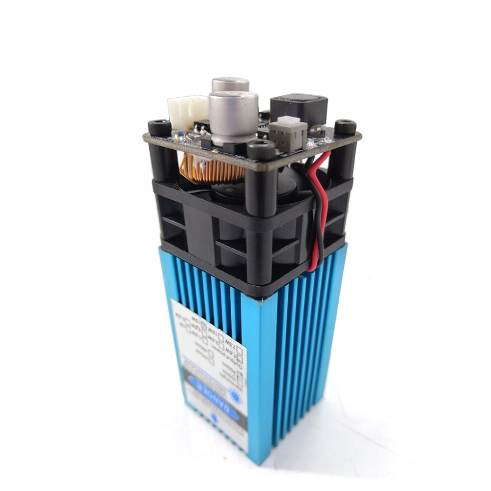

15W Laser Mount for Generic Chinese "Laser 6550".

Bought a Cheap 6550 frame sans laser and separate 15W laser. Making up a mount so that I can easily adjust the height of the fixed focus laser.

- [https://www.aliexpress.com/wholesale?SearchText=Laser+6550](https://www.aliexpress.com/wholesale?SearchText=Laser+6550)
- 

